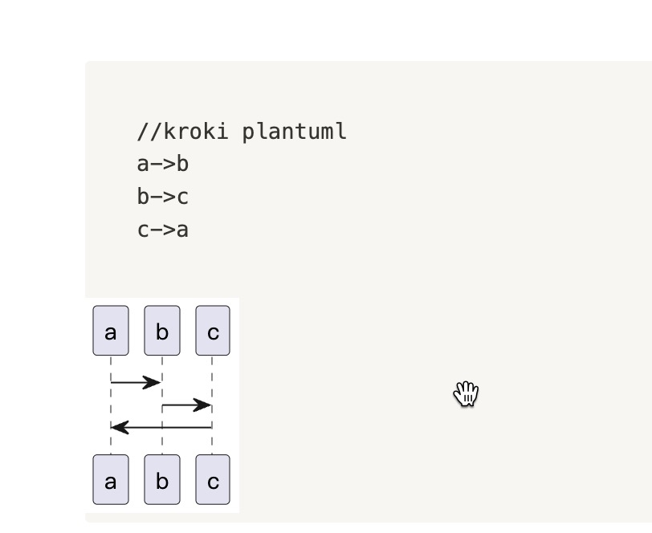

# notion-kroki

## 前置条件(Pre Condition)

### Make sure you have installed **Violentmonkey** or **Tampermonkey**

### 在使用之前请先确保你已经在浏览器安装了脚本管理插件 **Violentmonkey** 或者 **Tampermonkey**

| Browser | Violentmonkey                          | Tampermonkey                         |
|---------|----------------------------------------|--------------------------------------|
| Chrome  | [Violentmonkey][chrome_violentmonkey]  | [Tampermonkey][chrome_tampermonkey]  |
| Firefox | [Violentmonkey][firefox_violentmonkey] | [Tampermonkey][firefox_tampermonkey] |
| Edge    | [Violentmonkey][edge_violentmonkey]    | [Tampermonkey][edge_tampermonkey]    |

## 安装(How to install)

### [🚀 🚀 🚀 🚀 🚀 click me install 🚀 🚀 🚀 🚀 🚀][install_link]

### [🚀 🚀 🚀 🚀 🚀 点我安装 🚀 🚀 🚀 🚀 🚀][install_link]

## Usage

1. Add a  **Plain Text** code block with content

```text
//kroki plantuml
a->b
b->c
c->a
```

PS:  **first line is very important**

2. Then **refresh** noition page, you will got like this



[chrome_violentmonkey]: https://chrome.google.com/webstore/detail/violent-monkey/jinjaccalgkegednnccohejagnlnfdag

[chrome_tampermonkey]: https://chrome.google.com/webstore/detail/tampermonkey/dhdgffkkebhmkfjojejmpbldmpobfkfo

[firefox_tampermonkey]: https://addons.mozilla.org/firefox/addon/tampermonkey/

[firefox_violentmonkey]: https://addons.mozilla.org/firefox/addon/violentmonkey/

[edge_tampermonkey]: https://microsoftedge.microsoft.com/addons/detail/tampermonkey/iikmkjmpaadaobahmlepeloendndfphd

[edge_violentmonkey]: https://microsoftedge.microsoft.com/addons/detail/violentmonkey/eeagobfjdenkkddmbclomhiblgggliao

[opera_tampermonkey]: https://addons.opera.com/extensions/details/tampermonkey-beta/

[opera_violentmonkey]: https://addons.opera.com/extensions/details/violent-monkey/

[install_link]: https://raw.githubusercontent.com/zuisong/notion-kroki/master/notion-kroki.user.js
